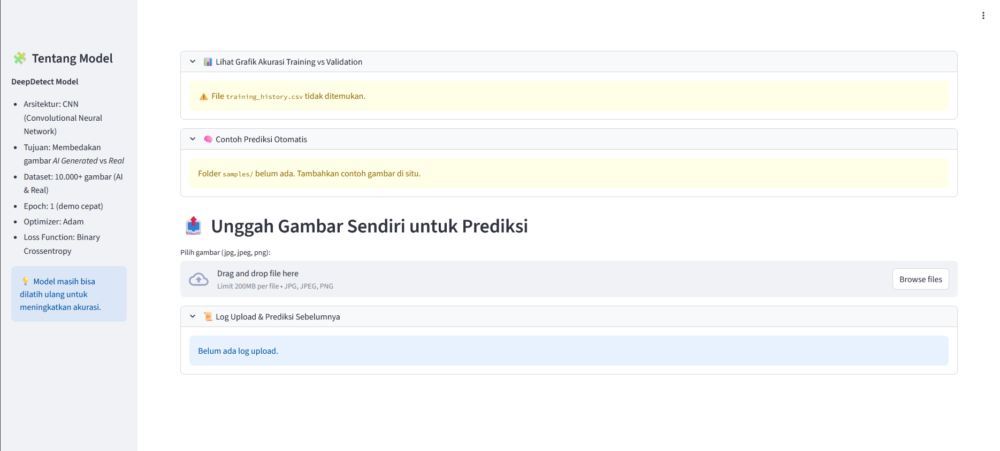

# 🧠 DeepDetect: Klasifikasi Gambar AI Generated vs Real

Proyek ini merupakan aplikasi berbasis **Deep Learning (CNN)** untuk membedakan gambar **AI Generated (buatan AI)** dan **Real (foto asli)**.  
Aplikasi ini dibangun menggunakan **Python** dan framework **Streamlit** sebagai antarmuka pengguna interaktif.

---

## 📸 Tampilan Dashboard
Berikut tampilan utama aplikasi prediksi gambar:

---

## 🚀 Fitur Utama

- **Upload Gambar untuk Prediksi:**  
  Pengguna dapat mengunggah gambar (.jpg, .jpeg, .png) untuk dianalisis oleh model dan mendapatkan hasil prediksi apakah gambar tersebut buatan AI atau foto asli.

- **Contoh Prediksi Otomatis:**  
  Aplikasi dapat menampilkan contoh hasil prediksi dari folder `samples/` (dapat ditambahkan manual oleh pengguna).

- **Grafik Akurasi Training vs Validation:**  
  Menampilkan performa model selama proses pelatihan menggunakan data `training_history.csv`.

- **Riwayat Upload & Prediksi Sebelumnya:**  
  Menyimpan log hasil prediksi yang sudah dilakukan oleh pengguna.

---

## 🧩 Arsitektur Model

Model dilatih menggunakan arsitektur **Convolutional Neural Network (CNN)** dengan parameter berikut:

| Komponen | Detail |
|-----------|--------|
| **Optimizer** | Adam |
| **Loss Function** | Binary Crossentropy |
| **Dataset** | 10.000+ gambar (AI & Real) |
| **Epoch** | 1 (demo cepat) |
| **Tujuan** | Membedakan gambar AI Generated vs Real |

---

## 🧱 Teknologi yang Digunakan

- **Python 3.x**
- **TensorFlow / Keras**
- **Streamlit**
- **NumPy**
- **Pandas**
- **Matplotlib**

---

## 📂 Struktur Folder

